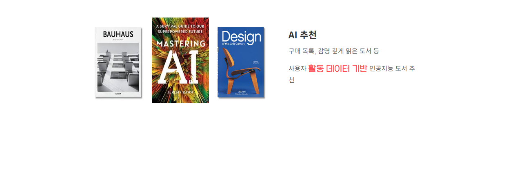
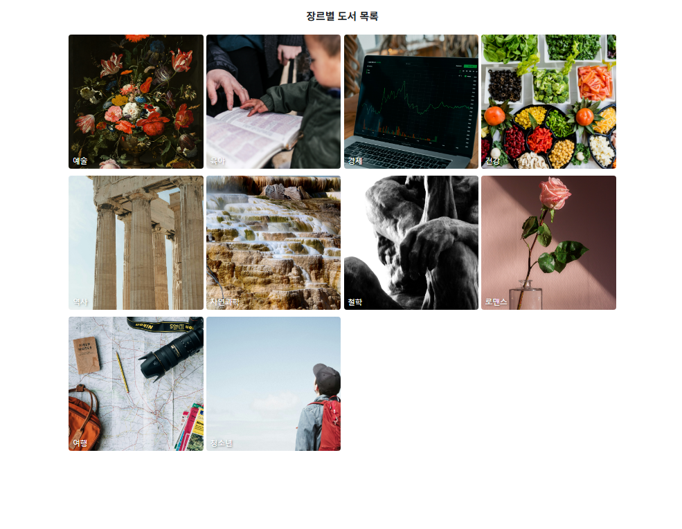

# 관통 PJT 03 | 반응형 웹 페이지

<aside>

도서 | 정환승, 박준아

</aside>

## 작성한 코드

- `02-bestseller.html`
- `03-ai-recommendation.html`
- `04-genre_list.html`






## 배운점

### Bootstrap - Carousel Autoplay

- `active` 클래스를 추가하면 자동 재생된다.
- carousel-item, active와 d-flex를 같은 div의 클래스로 추가하면 모든 슬라이드가 겹쳐서 보인다.
    
    문제의 원인은 `.carousel-item`에 직접 `d-flex` 클래스를 사용했기 때문이다. Carousel은 `.carousel-item`의 `display` 속성을 제어하여 슬라이드를 하나씩 보여주는데, `d-flex`가 이 동작을 방해하여 모든 슬라이드가 한 번에 표시된 것.
    
- 이 문제를 해결하기 위해 각 `.carousel-item` 내부에 새로운 `div`를 추가하고, 그 `div`에 `d-flex` 클래스를 적용해야 한다.

```html
<div id="bestsellerAutoplaying" class="carousel slide" data-bs-ride="carousel">
  <div class="carousel-inner">
    <!-- 슬라이드 1 -->
    <div class="carousel-item active">
      <div class=" d-flex flex-row justify-align-evenly">
        <div class="d-flex flex-column mx-3">
          
          <p class="text-center pt-2">소년이 온다</p>
        </div>
        <div class="d-flex flex-column mx-3">
          
          <p class="text-center pt-2">채식주의자</p>

        </div>
        <div class="d-flex flex-column mx-3">
          
          <p class="text-center pt-2">대온실 수리 보고서</p>
        </div>
        <div class="d-flex flex-column mx-3">
          
          <p class="text-center pt-2">급류</p>
        </div>
      </div>
    </div>
    <!-- 슬라이드 2 -->
    <div class="carousel-item">
      <..>
    </div>
    <!-- 슬라이드 3 -->
    <div class="carousel-item">
      <..>
    </div>
  <!-- 우측 (next) 버튼 -->
  <button class="carousel-control-next" type="button" data-bs-target="#bestsellerAutoplaying"
    data-bs-slide="next">
    <span class="carousel-control-next-icon" aria-hidden="true"></span>
    <span class="visually-hidden">Next</span>
  </button>
</div>
</div>
```

### 이미지 비율 설정하기

Bootstrap에서 이미지 비율 설정하기

- `ratio ratio-1x1`
- `object-fit-cover` 이미지 비율을 유지하면서 박스에 맞추기
- `object-fit-contain` 박스 크기에 이미지 맞추기

```html
<div class="genre-grid d-flex flex-wrap">
  <div class="position-relative item-width mb-2">
    <div class="ratio ratio-1x1">
      
    </div>
    <p class="position-absolute bottom-0 text-white m-2">예술</p>
  </div> 
  <div class="position-relative item-width mb-2">
    <div class="ratio ratio-1x1">
      
    </div>
    <p class="position-absolute bottom-0 text-white m-2">육아</p>
  </div>
  <div class="position-relative item-width mb-2">
    <div class="ratio ratio-1x1">
      
    </div>
    <p class="position-absolute bottom-0 text-white m-2">경제</p>
  </div>
  <div class="position-relative item-width mb-2">
    <div class="ratio ratio-1x1">
      
    </div>
    <p class="position-absolute bottom-0 text-white m-2">건강</p>
  </div>
    <..>
</div>
```

### 반응형 웹에서 아이템의 폭 설정

412px보다 작을 때는 아이템이 1열로 배치되고, 
412px보다 클 때는 아이템이 4열로 배치될 수 있도록 하는 코드를 작성할 때,

bootstrap의 breakpoints를 사용할 수 없으므로 미디어 쿼리를 사용해야 한다.

해당 경우, `col-sm-3`같이 grid system을 지정할 수 없으므로 `width`를 비율(%)로 지정해야 한다. 

```css
    @media (max-width: 412px) {

      /* 장르 아이템 폭 100%로 지정, 1열로 배치 */
      .item-width {
        box-sizing: border-box;
        padding: 0.2rem;
        width: 100%;
      }
    }

    @media (min-width: 412px) {

      /* 기본적으로 4열 배치 */
      .item-width {
        box-sizing: border-box;
        padding: 0.2rem;
        width: 25%;
      }
    }
```

## 느낀점

### Bootstrap의 편리함

412px을 새로운 breakpoint로 하는 미디어 쿼리를 작성하기가 너무 어려웠다.

만약 bootstrap에서 지정한 breakpoints (  xs: 0,  sm: 576px,  md: 768px,  lg: 992px,  xl: 1200px,  xxl: 1400px )를 사용할 수 있었다면 클래스를 사용하기가 훨씬 수월했을 것 같다.

그래도 어려운 만큼 모르는 것들 하나하나 찾아보고 실행해보면서 적용해보는 과정에서, 클래스를 어떻게 써야 하는지, 속성을 어떻게 주어야 하는지 점점 감을 잡아갈 수 있었다.